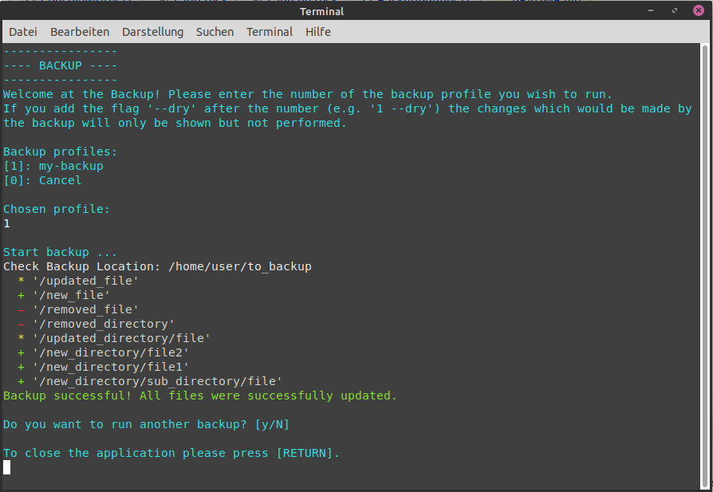

# Backup

## Introduction

This console application lets the user backup directories via mirroring them to another path.
The destination directory might be located on another connected device.

## Screenshot



## Configuration

The configuration of the backup is done via XML files. 
Those files must be placed inside the directory _backup\_profiles_. 
Thus the folder structure looks as follows:

```
parent-directory
|
|-- backup_profiles
|   |
|   |-- profile1.xml
|   |-- my-backup-profile.xml
|   |-- ...
|
|-- Application
    |-- Backup / Backup.exe
    |-- ...
``` 

The _Application_ directory can be renamed as desired.
The names of the profile files are also free selectable. 
However note that those names are shown when selecting the correct profile after starting the application.
Thus in the example structure above the user could choose between the profiles 'profile1' and 'my-backup-profile' to be executed. 

The following file shows an example configuration. 
There can be added multiple _backup\_location_ entries if required. 
Each of those entries defines the backup of one single directory.
It is also possible to add multiple _path_ entries inside the _exclude_ element. 
If no path should be excluded, the whole _exclude_ entry has to be omitted.

```xml
<?xml version="1.0" encoding="utf-8"?>
<backup_profile>
    <backup_location>
        <src>/home/user/to_backup</src>
        <dest>/media/user/device/is_backup</dest>
        <exclude>
            <path>/home/user/to_backup/do_not_backup</path>
        </exclude>
    </backup_location>
</backup_profile>
```

In this example the directory _/home/user/to_backup_ is backed up to _/media/user/device/is\_backup_. The sub directory _do\_not\_backup_
however is not copied during the backup because it is marked as an excluded path.

### Wildcards

You can use wildcards for excluding multiple files or directories with configuring only one exclude path.
Currently the following wildcards are allowed:

|  wildcard pattern  |                                meaning                                     |                          example                                       |
|         :---:      |                                  ---                                       |                            ---                                         |
| \*._\<ext\>_       | exclude all files with the given file extension                            | _\*/.class_ for excluding all files with _.class_ extension            |
| \*/_\<dir\>_/\*    | exclude all sub directories inside the backup location with the given name | _\*/node_modules/\*_ for excluding all _node\_modules_ sub directories |

The following file shows how to use the example wildcards from the table above inside an actual backup profile:

```xml
<?xml version="1.0" encoding="utf-8"?>
<backup_profile>
    <backup_location>
        <src>/home/user/to_backup</src>
        <dest>/media/user/device/is_backup</dest>
        <exclude>
            <path>*.class</path>
            <path>*/node_modules/*</path>
        </exclude>
    </backup_location>
</backup_profile>
```

## Structure

The `Start` class inside the `Start` namespace marks the entry point for the application. 
This class is responsible for reading the backup profiles and starting the backup. 
If an error occurs while fetching the backup configurations or while reading an invalid user input, the `Start` class will show a message for locating the problem.

The actual Backup is done by the `BackupRunner` class inside the `Start` namespace. 

For converting the XML configuration files the `XML` package contains the class `BackupProfileConverter`.
This converter is responsible for creating the objects of the types `BackupProfile` and `BackupLocation` inside the
`Data` package. 
Note that an object of the type `BackupLocation` corresponds to a directory that should be backed up.

## Build and use the application

1. Publish for the desired platform (Linux and Windows tested, Mac should also work)
2. If not published as 'Self-contained' install the .NET 5 runtime on the device
3. Create the folder structure described below the chapter 'Configuration'
4. Create one or more backup profiles (.xml files, structure see in chapter 'Configuration')
5. Start the application (Linux: Backup, Windows: Backup.exe)
6. Choose one of the backup profiles (the number displayed inside the square brackets 
   (e.g. press _1_ and _Return_ afterwards for selecting the profile with the prefix '\[1\]'))

**Attention:** 
The backup run will exactly create a copy of the source directory at the destination path.
This includes deleting files at the destination that are not longer saved at the source.
Thus take care when defining and running backup profiles.